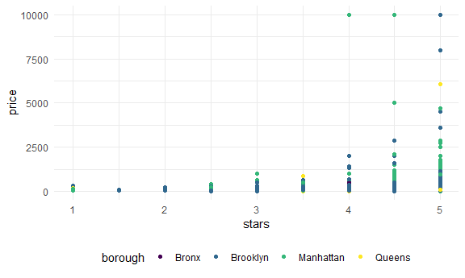
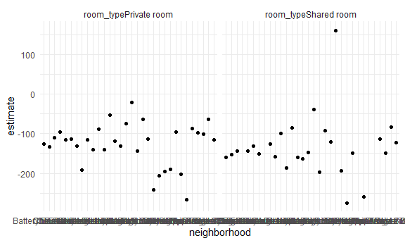

Linear model
================
nz2333
12/3/2021

``` r
library(tidyverse)
```

    ## -- Attaching packages --------------------------------------- tidyverse 1.3.1 --

    ## v ggplot2 3.3.5     v purrr   0.3.4
    ## v tibble  3.1.4     v dplyr   1.0.7
    ## v tidyr   1.1.3     v stringr 1.4.0
    ## v readr   2.0.1     v forcats 0.5.1

    ## -- Conflicts ------------------------------------------ tidyverse_conflicts() --
    ## x dplyr::filter() masks stats::filter()
    ## x dplyr::lag()    masks stats::lag()

``` r
library(p8105.datasets)

set.seed(1)

knitr::opts_chunk$set(
  fig.width = 6,
  fig.asp = .6,
  out.width = "90%"
)

theme_set(theme_minimal() + theme(legend.position = "bottom"))

options(
  ggplot2.continuous.colour = "viridis",
  ggplot2.continuous.fill = "viridis"
)

scale_colour_discrete = scale_colour_viridis_d
scale_fill_discrete = scale_fill_viridis_d
```

\#Import data

``` r
data("nyc_airbnb")

nyc_airbnb = 
  nyc_airbnb %>% 
  mutate(stars = review_scores_location / 2) %>% 
  rename(
    borough = neighbourhood_group,
    neighborhood = neighbourhood) %>% 
  filter(borough != "Staten Island") %>% 
  select(price, stars, borough, neighborhood, room_type)
```

# Firt a model

``` r
nyc_airbnb %>%
  ggplot(aes(x = stars, y = price, color = borough)) +
  geom_point()
```

    ## Warning: Removed 9962 rows containing missing values (geom_point).



``` r
fit = lm (price ~ stars +borough, data = nyc_airbnb)
```

Results:

look at the results better:

``` r
broom::glance(fit)
```

    ## # A tibble: 1 x 12
    ##   r.squared adj.r.squared sigma statistic   p.value    df   logLik    AIC    BIC
    ##       <dbl>         <dbl> <dbl>     <dbl>     <dbl> <dbl>    <dbl>  <dbl>  <dbl>
    ## 1    0.0342        0.0341  182.      271. 6.73e-229     4 -202113. 4.04e5 4.04e5
    ## # ... with 3 more variables: deviance <dbl>, df.residual <int>, nobs <int>

``` r
broom::tidy(fit) %>%
  select(-std.error, -statistic) %>%
  mutate(
    term = str_replace(term, "borough", "Borough: ")) %>%
  knitr::kable()
```

| term               |  estimate |   p.value |
|:-------------------|----------:|----------:|
| (Intercept)        | -70.41446 | 0.0000005 |
| stars              |  31.98989 | 0.0000000 |
| Borough: Brooklyn  |  40.50030 | 0.0000022 |
| Borough: Manhattan |  90.25393 | 0.0000000 |
| Borough: Queens    |  13.20617 | 0.1451682 |

## Be in control of factors

``` r
nyc_airbnb =
  nyc_airbnb %>%
  mutate(
    borough = fct_infreq(borough), 
    room_type = fct_infreq(room_type)
  )

nyc_airbnb %>%
  ggplot(aes(x = stars, y = price, color = borough)) +
  geom_point()
```

    ## Warning: Removed 9962 rows containing missing values (geom_point).


``` r
broom::tidy(fit)
```

    ## # A tibble: 5 x 5
    ##   term             estimate std.error statistic  p.value
    ##   <chr>               <dbl>     <dbl>     <dbl>    <dbl>
    ## 1 (Intercept)         -70.4     14.0      -5.02 5.14e- 7
    ## 2 stars                32.0      2.53     12.7  1.27e-36
    ## 3 boroughBrooklyn      40.5      8.56      4.73 2.23e- 6
    ## 4 boroughManhattan     90.3      8.57     10.5  6.64e-26
    ## 5 boroughQueens        13.2      9.06      1.46 1.45e- 1

now the reference group has changed to manhattan.

## diagnostics

``` r
nyc_airbnb %>%
modelr::add_residuals(fit) %>%
  ggplot(aes(x = borough, y = resid)) +
  geom_violin() +
  ylim(-500, 1500)
```

    ## Warning: Removed 9993 rows containing non-finite values (stat_ydensity).


``` r
nyc_airbnb %>%
modelr::add_residuals(fit) %>%
  ggplot(aes(x = stars, y = resid)) +
  geom_point() +
  facet_wrap(. ~ borough)
```

    ## Warning: Removed 9962 rows containing missing values (geom_point).


added a column in the data frame for residuals based on the model fit.
From violin plot, can see boroughs with extreme residuals. ylim: zoom in
the plot

## hypothesis test

``` r
fit %>%
  broom::tidy()
```

    ## # A tibble: 5 x 5
    ##   term             estimate std.error statistic  p.value
    ##   <chr>               <dbl>     <dbl>     <dbl>    <dbl>
    ## 1 (Intercept)         -70.4     14.0      -5.02 5.14e- 7
    ## 2 stars                32.0      2.53     12.7  1.27e-36
    ## 3 boroughBrooklyn      40.5      8.56      4.73 2.23e- 6
    ## 4 boroughManhattan     90.3      8.57     10.5  6.64e-26
    ## 5 boroughQueens        13.2      9.06      1.46 1.45e- 1

t-test for each parameter, if they are significant

``` r
fit_null = lm(price ~stars, data = nyc_airbnb)
fit_alt = lm(price ~stars + borough, data = nyc_airbnb)

anova(fit_null, fit_alt) %>%
  broom::tidy()
```

    ## # A tibble: 2 x 6
    ##   res.df         rss    df     sumsq statistic    p.value
    ##    <dbl>       <dbl> <dbl>     <dbl>     <dbl>      <dbl>
    ## 1  30528 1030861841.    NA       NA        NA  NA        
    ## 2  30525 1005601724.     3 25260117.      256.  7.84e-164

## nest data, fit models

``` r
fit = lm(price ~ stars * borough + room_type +borough, data = nyc_airbnb) 

broom::tidy(fit)
```

    ## # A tibble: 10 x 5
    ##    term                  estimate std.error statistic  p.value
    ##    <chr>                    <dbl>     <dbl>     <dbl>    <dbl>
    ##  1 (Intercept)              75.3      19.1      3.95  7.95e- 5
    ##  2 stars                    29.6       3.96     7.49  7.30e-14
    ##  3 boroughBrooklyn           6.06     24.8      0.245 8.07e- 1
    ##  4 boroughQueens            51.1      40.0      1.28  2.02e- 1
    ##  5 boroughBronx             52.6      76.8      0.686 4.93e- 1
    ##  6 room_typePrivate room  -105.        2.05   -51.1   0       
    ##  7 room_typeShared room   -130.        6.15   -21.1   7.15e-98
    ##  8 stars:boroughBrooklyn    -9.75      5.23    -1.87  6.20e- 2
    ##  9 stars:boroughQueens     -22.7       8.52    -2.66  7.73e- 3
    ## 10 stars:boroughBronx      -25.4      17.1     -1.49  1.37e- 1

another way, less complex

``` r
nyc_airbnb %>%
  nest(data = -borough) %>%
  mutate(
    models = map(.x = data, ~lm(price ~ stars, data = .x)),
    results = map(models, broom::tidy)
  ) %>%
  select(-data, -models) %>%
  unnest(results) %>%
  filter(term == "stars")
```

    ## # A tibble: 4 x 6
    ##   borough   term  estimate std.error statistic  p.value
    ##   <fct>     <chr>    <dbl>     <dbl>     <dbl>    <dbl>
    ## 1 Bronx     stars     4.91      4.10      1.20 2.31e- 1
    ## 2 Queens    stars    15.8       5.63      2.81 5.06e- 3
    ## 3 Brooklyn  stars    28.0       3.10      9.02 2.13e-19
    ## 4 Manhattan stars    43.3       4.78      9.07 1.39e-19

list data for each borough

## nest more

``` r
nyc_airbnb %>%
  filter(borough == "Manhattan") %>%
  nest(data = -neighborhood) %>%
  mutate(
    models = map(.x = data, ~lm(price ~ stars + room_type, data = .x)),
    results = map(models, broom::tidy)
  ) %>%
  select(-data, -models) %>%
  unnest(results) %>%
  filter(str_detect(term, "room_type")) %>%
  ggplot(aes(x = neighborhood, y = estimate)) +
  geom_point() +
  facet_wrap(. ~term)
```


